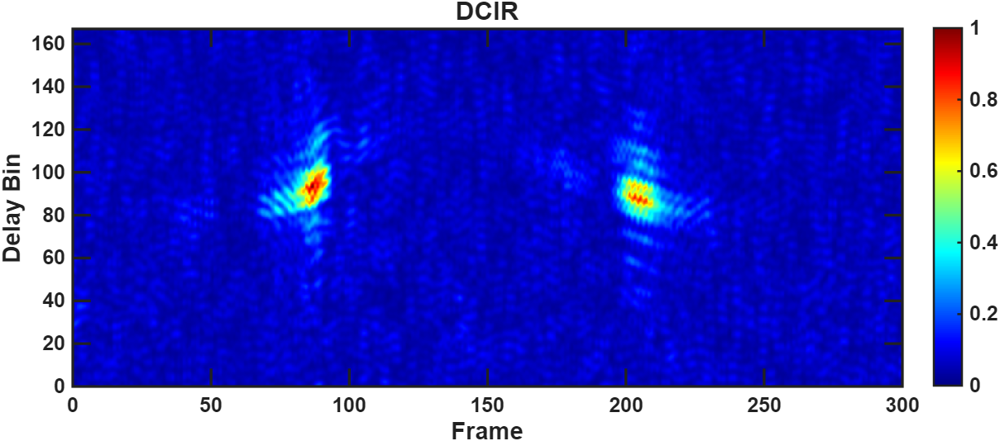

# EyePose

**EyePose** is a demonstration repository for DCIR (Differential Channel Impulse Response)–based hand-gesture sensing and pose estimation. This README provides a concise academic showcase: DCIR visualizations, ground-truth recordings, and model-predicted animations for side-by-side inspection.

---

## Abstract
This repository contains representative examples for a research demo of DCIR-driven gesture recognition. Each entry shows (1) the measured DCIR spectro-temporal representation, (2) the ground-truth hand motion recording, and (3) the model prediction (keypoint animation or reconstructed pose). The purpose is side-by-side qualitative comparison for demo and dissemination.

---

## How to view
- Click any thumbnail to open the recorded video file in GitHub (or download for local playback).  
- **Note:** GitHub is case-sensitive for file and folder names; ensure paths exactly match the files in `assets/`.  
- If you prefer inline playback, download the `.mp4` files and play locally (recommended for large files).

---

## Gallery (representative examples)

> For best results, open each video in a new tab or download.

| Gesture | DCIR (image) | Ground truth (video) | Model prediction (video) |
|---|---:|:---:|:---:|
| **Fist–Open** | [](assets/videos/groundtruth/GT_Fist-Open.mp4) | [Ground truth →](assets/videos/groundtruth/GT_Fist-Open.mp4) | [Prediction →](assets/videos/prediction/ypred_Fist-Open.mp4) |
| **Gather Fingers** | [](assets/videos/groundtruth/GT_Gather-Fingers.mp4) | [Ground truth →](assets/videos/groundtruth/GT_Gather-Fingers.mp4) | [Prediction →](assets/videos/prediction/ypred_Gather-Fingers.mp4) |
| **Pinch** | [](assets/videos/groundtruth/GT_Pinch.mp4) | [Ground truth →](assets/videos/groundtruth/GT_Pinch.mp4) | [Prediction →](assets/videos/prediction/ypred_Pinch.mp4) |
| **Push–Pull** | [](assets/videos/groundtruth/GT_Push-Pull.mp4) | [Ground truth →](assets/videos/groundtruth/GT_Push-Pull.mp4) | [Prediction →](assets/videos/prediction/ypred_Push-Pull.mp4) |
| **Rotate** | [](assets/videos/groundtruth/GT_Rotate.mp4) | [Ground truth →](assets/videos/groundtruth/GT_Rotate.mp4) | [Prediction →](assets/videos/prediction/ypred_Rotate.mp4) |
| **Tap** | [](assets/videos/groundtruth/GT_Tap.mp4) | [Ground truth →](assets/videos/groundtruth/GT_Tap.mp4) | [Prediction →](assets/videos/prediction/ypred_Tap.mp4) |

---

## Recommended playback (local)
If the GitHub preview does not play (browser or Pages limitations), download the files and play with a local player (e.g., VLC). To download quickly, open the target file link above and click **Download** on the GitHub file page.

---

## Implementation notes
- Video format recommended: `H.264` (video) + `AAC` (audio) in `.mp4` container with `-movflags +faststart` for streaming.  
- Filenames and folders are **case-sensitive**. Confirm names in the repo exactly match the paths referenced above.  
- If your repository uses Git LFS for large videos, GitHub Pages previews may not serve raw content; consider GitHub Releases or external hosting for large demo artifacts.

---

## Citation (BibTeX)
If you use this demo in academic material, please cite:

```bibtex
@inproceedings{your2025eyepose,
  title = {EyePose: DCIR-based Gesture Recognition},
  author = {Your Name and Coauthors},
  year = {2025},
  booktitle = {Demo / Workshop / Conference},
}
